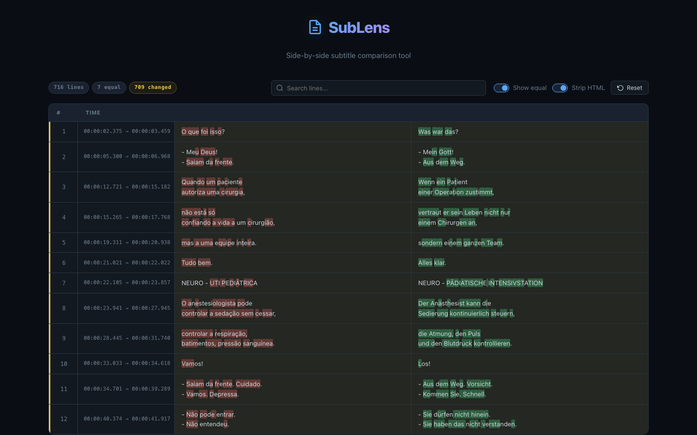

# SubLens

A browser-based SRT subtitle comparison tool with character-level diff highlighting. Upload two `.srt` files and instantly see a side-by-side breakdown of what changed — line by line, character by character.



## Features

- **Side-by-side diff** — Compare original and translated SRT files with color-coded rows (equal, changed, added, removed)
- **Character-level highlighting** — Inline character diffs pinpoint exactly what text changed within each line
- **Live stats** — Pill badges show total lines, equal, changed, added, and removed counts at a glance
- **Search** — Filter diff rows by text content or line number in real time
- **Toggle equal lines** — Hide unchanged lines to focus on differences
- **Strip HTML** — Remove `<i>`, `<b>`, and other tags from subtitle text before comparing
- **Drag & drop or paste** — Load files via drag-and-drop, file picker, or paste raw SRT content directly
- **Sample data** — One-click "Load sample subtitles" to explore the tool instantly
- **Client-only** — No server, no uploads, no API calls. Everything runs in your browser

## Getting Started

### Prerequisites

- [Bun](https://bun.sh) (or npm/pnpm)

### Install & Run

```bash
bun install
bun run dev
```

Open the URL shown in your terminal (default `http://localhost:5173`).

### Build for Production

```bash
bun run build
```

Output is written to `dist/`. Preview it with:

```bash
bun run preview
```

## Testing

End-to-end tests use [Playwright](https://playwright.dev):

```bash
npx playwright test
```

Tests spin up a Vite dev server programmatically and validate upload flows, sample loading, and diff rendering.

## Tech Stack

- **Vue 3** — Composition API with `<script setup>`
- **TypeScript** — Strict mode via `vue-tsc`
- **Vite** — Build tool and dev server
- **Playwright** — End-to-end testing

## License

MIT
